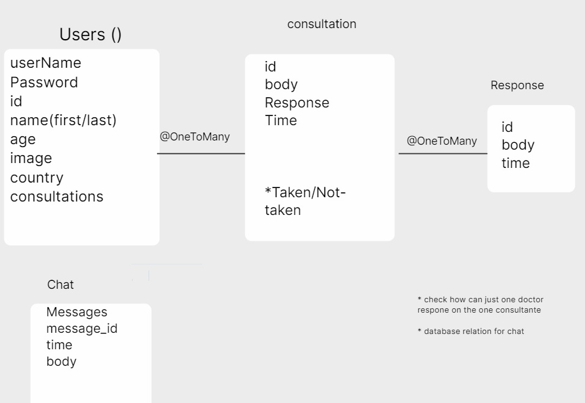
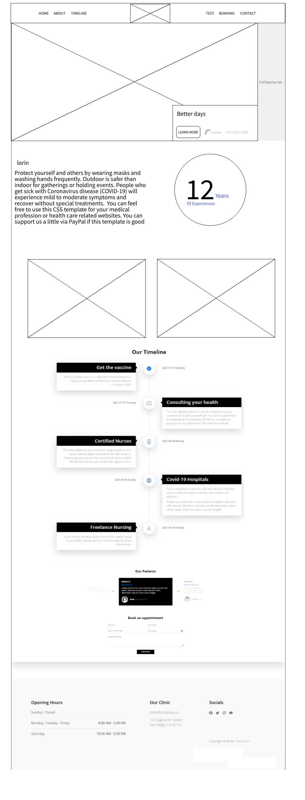

# OverView

# Project name : Better days

# Team members 

- Abdallah Hamoury
- Maiada Ibrahim
- Ahmad Bani Salameh
- Qutadah Almomani
- Mohammed Mosleh

### Project duration

one week 

### Description

 An application that helps students search for universities, and shows prestigious and accredited universities all over the world
 
 
#### Content
#### Cooperation Plan
#### Conflict Plan
#### Communication Plan
#### Work
#### Git Process

## Cooperation

What are the key strengths of each person on the team?
How can you best utilize these strengths in the execution of your project?
In which professional competencies do you each want to develop greater strength?
Knowing that every person in your team needs to understand all aspects of the project, how do you plan to approach the day-to-day work?

### Conflict
## What will be your group's process to resolve conflict, when it arises?

There will be no differences because we work as an integrated team and we respect each other's opinions and understand all opinions and points of view

### What will your team do if one person is taking over the project and not letting the other members contribute?

It will prevent him from doing so because we work with the concept of one team

### How will you approach each other and the challenges of the project knowing that it is impossible for all members to be at the exact same place in understanding and skill level?

We will discuss the code together at the end of the day and explain the unclear parts to those who did not fully understand the code

### How will you raise concerns to members who are not adequately contributing?

I will assign more tasks for him/her, and set deadline for that task.

 
### How and when will you escalate the conflict if your resolution attempts are unsuccessful?

### Communication
What hours will you be available to communicate?
Daily from 10 am to 6 pm

### What platforms will you use to communicate (ie. Slack, phone …)?
Discord
Slack.
Zoom.

### How often will you take breaks?
 lunch break.
 
### What is your plan if you start to fall behind?

We will assign more tasks and give priorities to each task based on its importance.

### How will you communicate after hours and on the weekend?
We will chat on slack and we will use Whatsapp for urgent meetings.

### What is your strategy for ensuring everyone’s voice is heard?

### How will you ensure that you are creating a safe environment where everyone feels comfortable speaking up?

We will explain the aspects that you did not understand to everyone

### Work
How you will identify tasks, assign tasks, know when they are complete, and manage work in general?
Kanban on Github

### Git

What components of your project will live on GitHub?
We will have two repos on our project:

a front-end data from the back-end repo.
a back-end repo that will be the API (server) that will work with a 
 

### How will you share the repository with your teammates?

### What is your Git flow?
We will take a sub branch from the main branch and call it "test" will work on.

### Will you be using a PR review workflow? If so, consider
How many people must review a PR?

The team leader 

### Who merges PRs?
The whole team will do the operation at the end of the day

### How often will you merge?
daily

### How will you communicate that it’s time to merge?
in the end of the day

#Team Agreement
Conflict Plan

What will your group do when it encounters conflict? We will try to solve it between us. by knowing the reason and giving a logical solution. If it doesn't work, we will put the TA in the situation.

How will you raise concerns to members who are not adequately contributing? We will try to know his reasons and make him aware of the consequences. If it doesn't work we will tell the instructor about him.

What is your process to resolve conflicts? make a meeting with the team members to know the reason and give a logical solution. If it doesn't work, we will put the TA in the situation.

How and when will you escalate the conflict if your attempts are unsuccessful? When we failed to solve it between us.

Communication Plan

What hours will you be available to communicate? We decide working hours for the next day and we communicate at these hours.

What platforms will you use to communicate (ie. Slack, phone …? Till this moment we use Slack, Zoom, and Discord.

How often will you take breaks? Not too much during the day. about a half an hour every four working hours.

What is your plan if you start to fall behind? Duplicate our effort and increase working hours. also divide the topics into priority, important, and less important.

How will you communicate after hours and on the weekend? Slack, Zoom, and Discord.

What is your strategy for ensuring everyone’s voice is heard? Take's everyone's opinion before any step.

How will you ensure that you are creating a safe environment where everyone feels comfortable speaking up? By listening to everybody in the group.

Work Plan

How will you identify tasks, assign tasks, know when they are complete, and manage work in general? By knowing the strengths and knowledge of the team members, allocate tasks accordingly, estimating the time needed to complete them, and making sure that the work is going according to plan.

What project management tool will be used? Inttilij, Git, VS code, wireframe.cc, Trello, colorhunt, and Github.

Git Process

What components of your project will live on GitHub? We started with making the structure and configuration files and every necessary work that we need to distribute the work and start with it. How will you share the repository

with your teammates? We created our organization and created the project repository. and now it's ready to be cloned by every member.

What is your Git flow? Done by creating a sub-branch to bush all work on it. not in the main. Also, every member will work in a separate repository and push the work to the group repository after we make sure it's completely right.

User Stories
as a user (patient) i want to enter the web application that save my privacy
as a doctor i prefer to meet my patient online that keep people more comfortable
as a user i prefer to find people to support me and understand what i suffer
as a doctor i prefer to serve people online thats enable me to serve and to get more consultation from patients
as a user i like the idea for chooes my doctor online thats provide more options for me
Software Requirements
Vision: create a web application to support people whos need addicted people
Scope (In/Out):
web application about mental-healthcare
we have a alot of features to help pationt to get the best services
we have a page to aware people about mental health and know more about mental-healthcare
we have support group to help pationt to get support from others pationt
we have a part of consultation to get consultante from therapists
Stretch : schadualing an appointment for specific user with specific therepist

